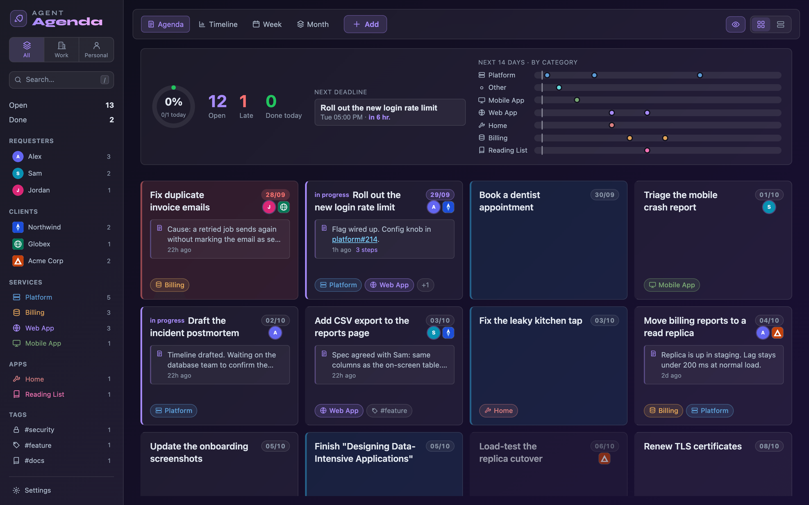
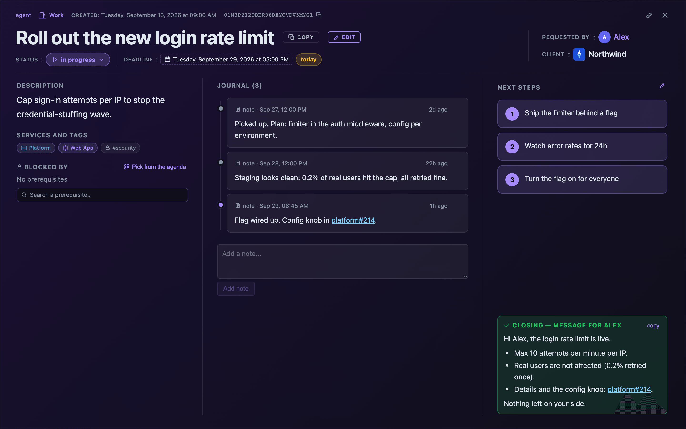
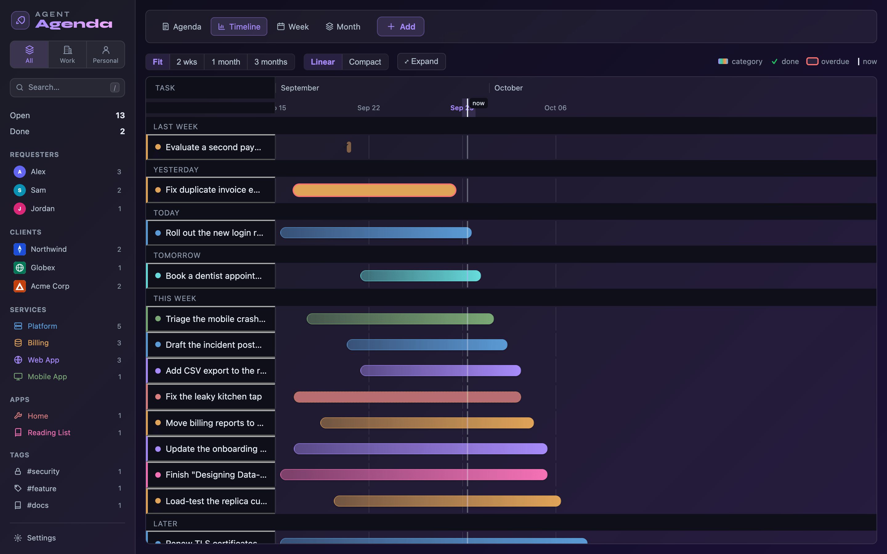
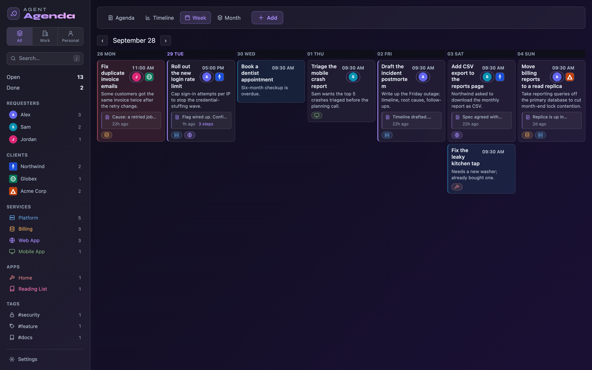
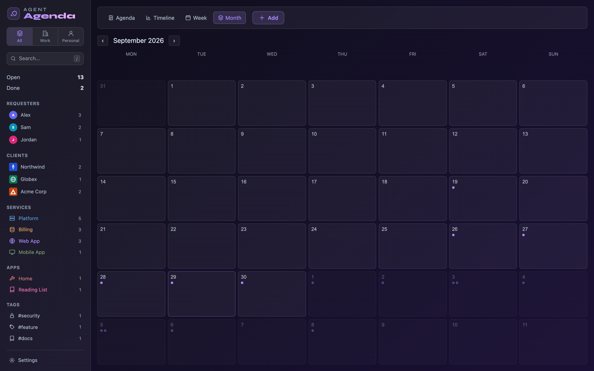
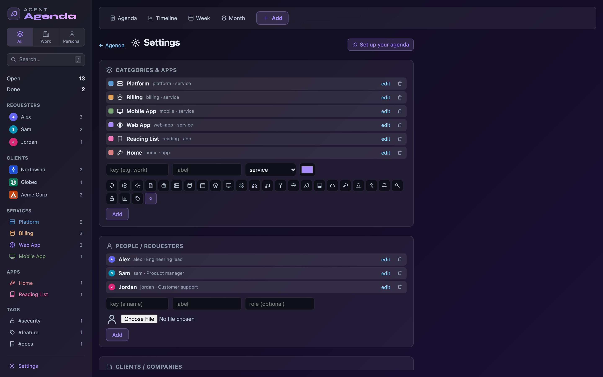
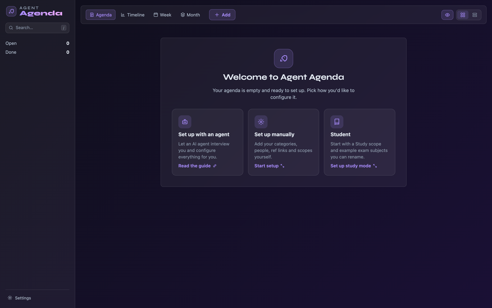
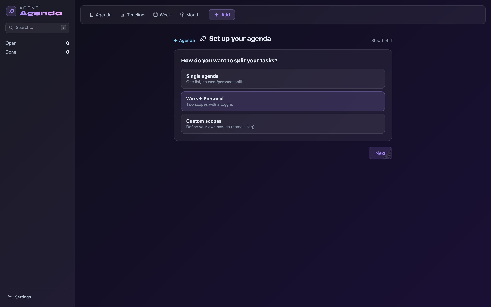
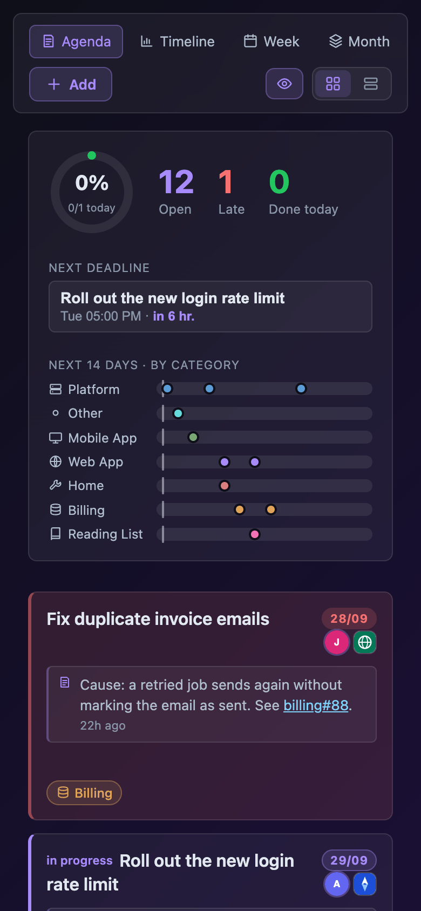

# agent-agenda

**A self-hosted agenda your coding agent writes to, and you review.**



Most task apps assume *you* type the tasks and an AI helps you schedule them.
agent-agenda flips that: your **agent** logs tasks, progress and decisions as it works,
and **you** watch it all land on a live agenda. It is the part of "agent memory" you can
read, edit and trust: not an opaque vector store, but a plain agenda.

It ships **completely empty** and is **fully customizable**: categories, people,
clients, repository links, scopes, icons, colors, reminders and language are all
yours to define, from the UI, a setup wizard, one JSON file, or by letting an agent
interview you. It runs on your own machine. English and Italian are included.

## Why

When an agent works across sessions and repositories, the hard part is not doing the
work. It is **remembering** it, and keeping you in the loop.

- **The agent writes as it goes:** a task when it starts something, a note at each
  milestone, an updated plan when the next steps change, a handoff message at the end.
- **You review at a glance:** the dashboard, week, month and timeline views show what
  is due and what moved, without opening anything.
- **The next session picks up where the last one stopped:** a fresh agent finds the
  task by keyword or id and reads its history back.

Every task has three parts: **notes** (what happened), **steps** (what comes next) and
a **closing** message (how it ended, ready to send to whoever asked).

## Features

- **Agent-first HTTP API** to create tasks, add notes, replace the plan, write the
  closing message and link dependencies. Shell helpers in [`scripts/`](scripts/) wrap
  every common call, and natural-language dates ("tomorrow 10am", "in 3 days") are
  parsed server-side.
- **Installable agent skills** for Claude Code, plus a tool-agnostic
  [`AGENTS.md`](AGENTS.md) that any agent can follow.
- **Fully configurable, nothing hardcoded:** categories with your own icons and
  colors, people with avatars, clients with logos, repository shorthands that turn
  `web#42` into a link, and scopes such as Work and Personal.
- **Four views:** a dashboard with progress and a 14-day outlook, a week board, a
  month calendar and a timeline.
- **Task drawer** with the note timeline, ordered next steps, a closing message and
  blocking links between tasks.
- **Reminders:** due and reminder times, snooze, browser notifications, and optional
  native macOS notifications.
- **Dependencies:** a task waits on its prerequisites and stays quiet until they are done or shelved.
- **Study mode:** subjects with exam dates, countdowns, pace and a "distribute topics"
  helper.
- **Live updates** over WebSocket: what the agent writes appears without a refresh.
- **Multilingual:** English and Italian bundled, one JSON file per extra language.
- **Small and self-contained:** Bun + SQLite backend, SvelteKit frontend, two containers.

## Screenshots

| Task drawer | Timeline |
| --- | --- |
|  |  |

| Week | Month |
| --- | --- |
|  |  |

| Settings | First run |
| --- | --- |
|  |  |

| Setup wizard | Phone |
| --- | --- |
|  |  |

## Quick start

Requirements: Docker with Compose.

```bash
git clone https://github.com/giacorri/agent-agenda.git
cd agent-agenda
docker compose up -d --build
```

Open <http://localhost:4011>. The API listens on <http://localhost:4010> and the
database is stored in `./data/tasks.db`. Both ports are bound to `127.0.0.1` only.

To look around with demo data instead of an empty agenda, see
[Development](#development).

> **No built-in authentication.** agent-agenda is a single-user tool meant for
> `localhost` or for a reverse proxy that adds authentication. Do not expose it directly
> to the internet. See [SECURITY.md](SECURITY.md) and [docs/self-hosting.md](docs/self-hosting.md).

## Configuration

A fresh install is empty on purpose. The first-run screen offers three ways to set it up:

1. **Setup wizard** (`/onboarding`): scopes, categories, people and reminder time in
   four short steps.
2. **Settings** (`/settings`): add and edit everything by hand, including icons,
   colors, avatars and logos.
3. **Let an agent do it:** the agent interviews you and applies one config document:

   ```bash
   scripts/bootstrap-config.sh docs/examples/example-config.json
   ```

Everything you can customize (categories, icons, colors, people, clients and logos,
reference shorthands, scopes, reminders, language, study mode and environment
variables) is described in **[docs/configuration.md](docs/configuration.md)**.

## Driving it from an agent

This is what agent-agenda is for. An agent with shell access runs the whole loop:

```bash
add-task.sh --title "Harden the login flow" --summary "Rate-limit sign-in attempts" \
  --when "tomorrow" --service web-app --requester Alex --step "Add the limiter" --step "Open a PR"
add-note.sh    "login flow" --body "Limiter added. See web#214."
set-steps.sh   "login flow" --step "Open a PR"
set-closing.sh "login flow" --message "Done: sign-in is rate-limited (web#214)."
done-task.sh   "login flow"
```

The same calls are plain HTTP (`POST /api/ingest`, `/api/ingest/note`,
`/api/ingest/steps`, `/api/ingest/closing`, `/api/ingest/link`, and REST under
`/api/tasks` and `/api/config`). Start with [`AGENTS.md`](AGENTS.md) for when to write
what, and see [docs/agent-api.md](docs/agent-api.md) for every endpoint and payload.

### Claude Code skills

The repository includes skills (`agenda`, `add-to-agenda`, `note-progress`,
`set-next-steps`, `handoff-recap`, `delegate-prompt`, `tidy-agenda`) in
[`.claude/skills/`](.claude/skills/). Install them, and link the helper scripts into
`~/.local/bin`, with:

```bash
scripts/install-claude-skills.sh
```

Other agents can read [`AGENTS.md`](AGENTS.md) and call the scripts or the API directly.

## Development

Requirements: [Bun](https://bun.sh) 1.3 or newer.

```bash
# Backend: HTTP + WebSocket on :4010
cd backend && bun install
bun run seed                                   # optional: demo data in ./demo.db
PORT=4010 DB_PATH=./demo.db CORS_ORIGIN=http://localhost:3000 bun run dev
```

```bash
# Frontend: Vite dev server on :3000
cd frontend && bun install
VITE_API_URL=http://localhost:4010 VITE_WS_URL=ws://localhost:4010/ws bun run dev
```

Tests and build: `cd backend && bun run test`, `cd frontend && bun run build`.
See [CONTRIBUTING.md](CONTRIBUTING.md) for the full workflow.

## Documentation

- [docs/configuration.md](docs/configuration.md): everything you can customize, and how.
- [AGENTS.md](AGENTS.md): how an agent should use the agenda.
- [docs/agent-api.md](docs/agent-api.md): API reference, every endpoint and script.
- [docs/setup-with-an-agent.md](docs/setup-with-an-agent.md): agent-driven setup, with a ready prompt.
- [docs/examples/](docs/examples/): an example config to start from.
- [docs/self-hosting.md](docs/self-hosting.md): Docker Compose, ports, data and reverse proxies.
- [docs/i18n.md](docs/i18n.md): adding a language.
- [CHANGELOG.md](CHANGELOG.md) · [SECURITY.md](SECURITY.md) · [CONTRIBUTING.md](CONTRIBUTING.md)

## Stack

- **Backend:** [Bun](https://bun.sh), `bun:sqlite`, WebSocket,
  [chrono-node](https://github.com/wanasit/chrono) for natural-language dates.
- **Frontend:** SvelteKit 2 with Svelte 5,
  [Paraglide](https://inlang.com/m/gerre34r/library-inlang-paraglideJs) for i18n.
- **Deployment:** Docker Compose, one image per service.

## Contributing

Issues and pull requests are welcome. Please read [CONTRIBUTING.md](CONTRIBUTING.md)
first, and open an issue before starting a large change.

## License

[MIT](LICENSE) © Giacomo Penco Salvi
